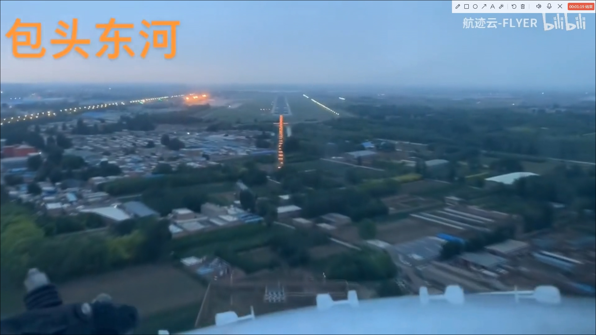

# AeroRun: A Runway Detection Dataset

AeroRun is a dataset designed for runway detection tasks using cockpit-view landing videos. The dataset provides a realistic visual perspective of runways during aircraft descent, making it a valuable resource for testing and developing runway detection models. AeroRun focuses on capturing a wide range of environmental conditions, including diverse airports, weather conditions, lighting environments, and angles, to evaluate model robustness in real-world scenarios.

## Dataset Overview

- **Number of videos**: 22
- **Total annotated frames**: 13,882
- **Resolution**: 1920×1080
- **Frame type**: Binary segmentation (runway vs. background)
- **Annotation format**: `.json` (polygonal masks for runway regions)

## Key Features

- **Environmental Diversity**: The dataset includes videos captured across various airports such as Beijing, Seoul, New York, and Singapore, with weather conditions such as rain, haze, and cloudy skies. It also features varying lighting environments (day and night) and different camera angles.
- **Small-Object Detection**: Runways in the dataset start off as distant and small objects and gradually become larger as the aircraft approaches. This scale progression adds complexity to detection models.
- **High-Quality Annotations**: All frames have been manually annotated using the LabelMe tool. Each frame is labeled with polygonal masks distinguishing the runway from the background. Quality control was conducted manually to ensure annotation accuracy.
  
## Usage

The dataset is intended for use in training and evaluating machine learning models for runway detection. The dataset can be used to benchmark the performance of detection models under different environmental conditions.

## Dataset Access

The AeroRun dataset is publicly available for download from [here](https://pan.baidu.com/s/1ntoX-9aSQJmrOwhG-hCmlw?pwd=2xwx).

## Dataset Contents

The dataset includes:

- **Video files**: 22 cockpit-view landing videos capturing various flight landings.
- **Annotations**: Manually annotated frames in `.json` format, containing both polygonal masks for runway regions and metadata such as video locations, frame count, and scene characteristics.

## Example

Below is a sample image frame and its corresponding annotation from the AeroRun dataset.

### Sample Frame



### Corresponding Annotation (JSON)

The annotation is in LabelMe format and includes a polygon that outlines the runway region:

```json
{
  "version": "5.4.1",
  "flags": {},
  "shapes": [
    {
      "label": "runway",
      "points": [
        [
          881.0,
          367.6
        ],
        [
          930.6,
          367.6
        ],
        [
          912.7,
          304.9
        ],
        [
          897.5,
          305.0
        ]
      ],
      "group_id": null,
      "description": "",
      "shape_type": "polygon",
      "flags": {},
      "mask": null
    }
  ],
  "imagePath": "序列 01000.jpg",
  "imageData": "xxxx",
  "imageHeight": 1080,
  "imageWidth": 1920
}

